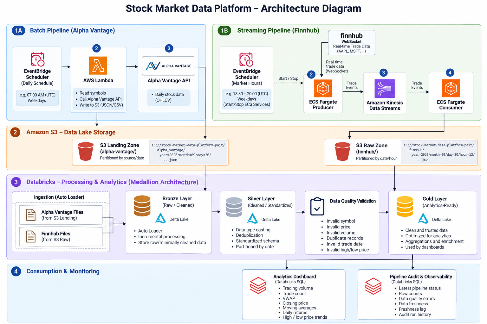
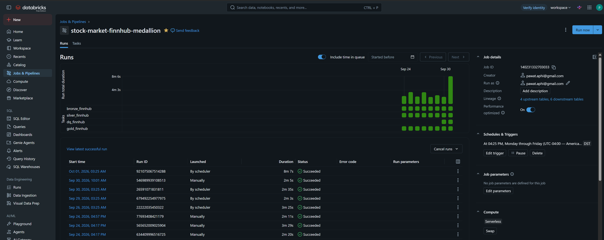
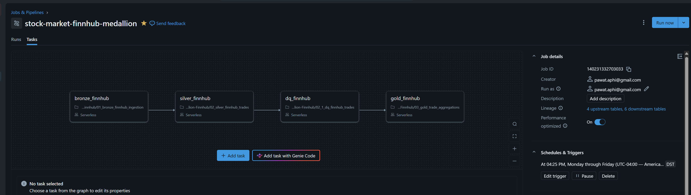

# Stock Market Data Platform

End-to-end data engineering project for ingesting, processing,
monitoring, and analyzing stock market data using AWS and Databricks.

## Architecture

The platform supports two ingestion patterns:

- Batch ingestion using Alpha Vantage
- Real-time streaming ingestion using Finnhub

Data is ingested into Amazon S3 and processed through a
Bronze → Silver → Gold Medallion Architecture in Databricks.

For a detailed architecture breakdown, see
[Architecture Documentation](docs/architecture.md).

## Screenshots / Demo

### Pipeline Orchestration

### Analytics Dashboard

## Tech Stack

- AWS Lambda
- Amazon EventBridge Scheduler
- Amazon S3
- Amazon Kinesis Data Streams
- Amazon ECS Fargate
- AWS Secrets Manager
- Databricks
- Apache Spark / PySpark
- Delta Lake
- Unity Catalog
- Databricks Jobs
- Databricks SQL / Dashboard
- Python

## Data Pipelines

### Batch Pipeline

EventBridge Scheduler
→ AWS Lambda
→ Alpha Vantage API
→ Amazon S3 Landing
→ Databricks Bronze
→ Silver
→ Data Quality
→ Gold

### Streaming Pipeline

Control flow:

EventBridge Scheduler
→ Start / Stop ECS Fargate Services

Data flow:

Finnhub WebSocket
→ ECS Fargate Producer
→ Amazon Kinesis
→ ECS Fargate Consumer
→ Amazon S3 Raw
→ Databricks Bronze
→ Silver
→ Data Quality
→ Gold

## Medallion Architecture

### Bronze

Stores raw or minimally transformed source data.

### Silver

Cleans, normalizes, casts data types, and removes duplicates.

### Gold

Contains aggregated and analytics-ready datasets used by dashboards.

## Incremental Processing

The pipelines use incremental processing to avoid reprocessing
the entire dataset on every run.

Techniques include:

- Databricks Auto Loader
- Checkpoints
- Delta MERGE
- Pipeline watermarks
- Affected-partition recomputation

## Data Quality

Data quality validation runs between Silver and Gold.

Checks include:

- Null or empty symbols
- Invalid prices
- Invalid volume
- Duplicate records
- Invalid trading dates
- Invalid high/low price relationships

If a DQ check fails, the Gold task is prevented from running.

## Observability

Pipeline execution and data quality metrics are recorded in:

workspace.gold.pipeline_audit

The observability dashboard tracks:

- Latest pipeline status
- Latest row count
- Data quality error metrics
- Data freshness status
- Freshness lag in days
- Audit run history

## Analytics Dashboard

The project includes dashboards for:

- Trading volume
- Trade count
- VWAP
- Stock closing price
- Moving averages
- Daily returns
- Daily volume
- High / low price trends

## Repository Structure

src/
    streaming/
docs/
    architecture.md
    data_dictionary.md
    project_documentation.md

## Future Improvements

Potential future enhancements include:

- Alerting for failed DQ checks
- Market-calendar-aware freshness monitoring
- Infrastructure as Code
- Additional market data sources